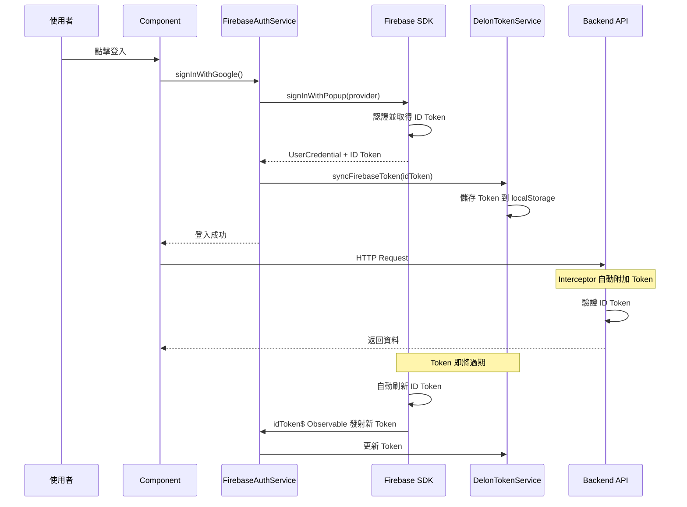
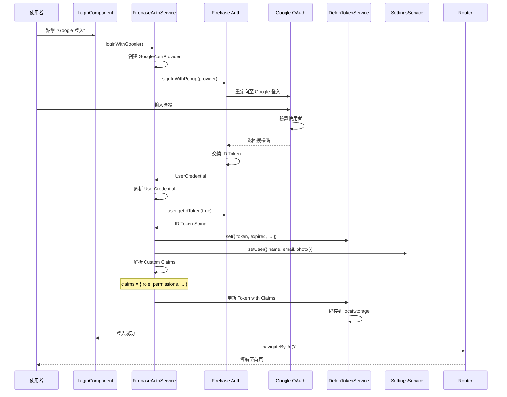
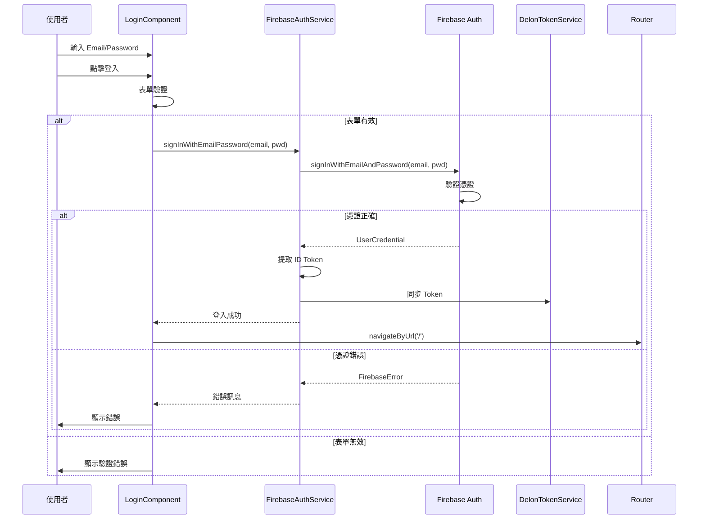
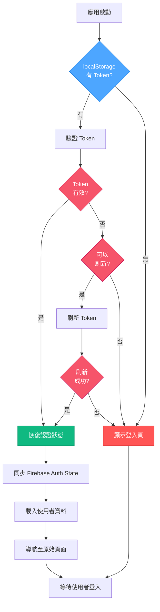
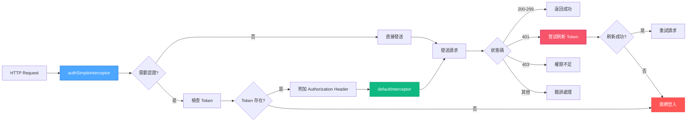
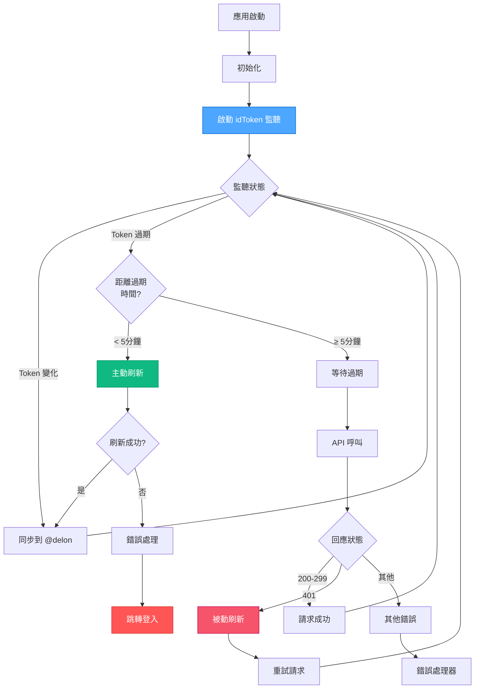

# Firebase Authentication + @delon/auth 整合設計文件

> **版本：** 1.0.0  
> **最後更新：** 2025-10-07  
> **技術棧：** Angular 20.3.0 + @angular/fire + @delon/auth 20.0.2 + Firebase SDK  
> **文件類型：** 完整設計與實作指南

---

## 📑 目錄

1. [核心設計理念](#核心設計理念)
2. [架構總覽](#架構總覽)
3. [登入流程](#登入流程)
4. [HTTP 請求與 Token 附加](#http-請求與-token-附加)
5. [Token 刷新機制（雙策略）](#token-刷新機制雙策略)
6. [關鍵代碼解析](#關鍵代碼解析)
7. [回調處理](#回調處理)
8. [刷新邏輯](#刷新邏輯)
9. [最佳實踐](#最佳實踐)
10. [建議流程圖](#建議流程圖)
11. [具體使用場景](#具體使用場景)
12. [實作建議與最佳實踐](#實作建議與最佳實踐)
13. [Token 刷新最佳實踐](#token-刷新最佳實踐)
14. [錯誤處理與日誌](#錯誤處理與日誌)
15. [安全 Header 配置](#安全-header-配置)
16. [完整實作範例](#完整實作範例)

---

## 🎯 核心設計理念

### 1. 設計哲學

Firebase Authentication + @delon/auth 整合方案基於以下核心理念：

| 理念 | 說明 | 優勢 |
|------|------|------|
| **無縫整合** | Firebase Auth 作為認證提供者，@delon/auth 作為 Token 管理層 | 充分利用兩者優勢 |
| **自動化優先** | Token 自動刷新、狀態自動同步、錯誤自動處理 | 減少手動干預 |
| **安全第一** | ID Token 驗證、Custom Claims 授權、安全儲存 | 符合最佳安全實踐 |
| **開發體驗** | RxJS Observable、依賴注入、TypeScript 型別安全 | 提升開發效率 |
| **靈活擴展** | 支援多種登入方式、自訂 Claims、離線持久化 | 適應不同場景 |

### 2. 架構優勢

```mermaid
graph TD
    A[Firebase Authentication] -->|提供| B[完整的認證服務]
    A -->|提供| C[ID Token 管理]
    A -->|提供| D[Custom Claims]
    
    E[@delon/auth] -->|提供| F[統一 Token 介面]
    E -->|提供| G[HTTP 攔截器]
    E -->|提供| H[路由守衛]
    
    B --> I[整合方案]
    C --> I
    D --> I
    F --> I
    G --> I
    H --> I
    
    I -->|產生| J[企業級認證系統]
    
    style A fill:#4da6ff,stroke:#0066cc,color:white
    style E fill:#10b981,stroke:#059669,color:white
    style I fill:#f6546a,stroke:#c30052,color:white
    style J fill:#ff5555,stroke:#dd3333,color:white
```

### 3. 核心組件

| 組件 | Firebase 提供 | @delon/auth 提供 | 整合方式 |
|------|--------------|------------------|----------|
| **認證流程** | Auth SDK | SocialService | Firebase → @delon Token |
| **Token 管理** | ID Token | DA_SERVICE_TOKEN | Observable 同步 |
| **HTTP 攔截** | - | authSimpleInterceptor | 附加 Firebase ID Token |
| **路由守衛** | - | CanActivateFn | 檢查 Firebase Auth State |
| **刷新機制** | Token Refresh | tryRefreshToken | 監聽 idToken 變化 |
| **Custom Claims** | Admin SDK | - | 嵌入 @delon Token |

---

## 🏗️ 架構總覽

### 整體架構圖

```mermaid
flowchart TB
    subgraph "前端 Angular 應用"
        A[Component] --> B[FirebaseAuthService]
        B --> C[@angular/fire/auth]
        C --> D[Firebase Auth SDK]
        
        A --> E[DelonTokenService]
        E --> F[@delon/auth]
        
        G[HTTP Interceptor] --> H[authSimpleInterceptor]
        H --> E
        
        I[Route Guard] --> J[firebaseAuthGuard]
        J --> C
    end
    
    subgraph "Firebase 服務"
        D --> K[Firebase Authentication]
        K --> L[ID Token Generation]
        L --> M[Custom Claims]
    end
    
    subgraph "後端 API"
        N[Protected API] --> O[Token Verification]
        O --> P[Custom Claims Check]
    end
    
    G --> N
    
    style C fill:#4da6ff,stroke:#0066cc,color:white
    style F fill:#10b981,stroke:#059669,color:white
    style K fill:#ff5555,stroke:#dd3333,color:white
    style N fill:#f6546a,stroke:#c30052,color:white
```

### 數據流向



---

## 🔐 登入流程

### 流程 1：Google 登入完整流程



### 流程 2：Email/Password 登入



### 流程 3：持久化登入狀態



---

## 🌐 HTTP 請求與 Token 附加

### 攔截器架構



### Token 附加機制

```typescript
// ✅ 推薦實作：Firebase ID Token 附加
export function firebaseAuthInterceptor(
  req: HttpRequest<any>,
  next: HttpHandlerFn,
  injector: Injector
): Observable<HttpEvent<any>> {
  const auth = injector.get(Auth);
  const tokenService = injector.get(DA_SERVICE_TOKEN);
  
  // 跳過不需要認證的請求
  if (req.context.get(ALLOW_ANONYMOUS)) {
    return next(req);
  }
  
  // 從 Firebase 獲取最新的 ID Token
  return from(auth.currentUser?.getIdToken() || Promise.resolve(null)).pipe(
    switchMap(idToken => {
      if (!idToken) {
        // 沒有 Token，跳轉登入
        toLogin(injector);
        return throwError(() => new Error('未登入'));
      }
      
      // 附加 Token 到請求 Header
      const clonedReq = req.clone({
        setHeaders: {
          'Authorization': `Bearer ${idToken}`,
          'X-Firebase-AppCheck': auth.app.options.appId || ''
        }
      });
      
      // 同步到 @delon/auth
      tokenService.set({
        token: idToken,
        expired: Date.now() + (60 * 60 * 1000) // Firebase Token 預設 1 小時
      });
      
      return next(clonedReq);
    }),
    catchError(err => {
      console.error('[Firebase Interceptor] Error:', err);
      return throwError(() => err);
    })
  );
}
```

### 配置攔截器鏈

```typescript
// app.config.ts
import { provideHttpClient, withInterceptors } from '@angular/common/http';
import { firebaseAuthInterceptor } from './core/interceptors/firebase-auth.interceptor';
import { defaultInterceptor } from './core/interceptors/default.interceptor';

export const appConfig: ApplicationConfig = {
  providers: [
    // HTTP 客戶端配置
    provideHttpClient(
      withInterceptors([
        firebaseAuthInterceptor,  // 第一層：Firebase Token 附加
        defaultInterceptor        // 第二層：錯誤處理與刷新
      ])
    ),
    
    // Firebase 配置
    provideFirebaseApp(() => initializeApp(environment.firebase)),
    provideAuth(() => getAuth()),
    
    // @delon/auth 配置
    provideAuth(),
    
    // 其他配置...
  ]
};
```

---

## 🔄 Token 刷新機制（雙策略）

### 策略總覽

| 策略 | 觸發方式 | 優勢 | 劣勢 | 適用場景 |
|------|---------|------|------|----------|
| **被動刷新** | HTTP 401 錯誤 | 簡單、不佔資源 | 會有請求失敗 | 低頻 API 呼叫 |
| **主動刷新** | Token 即將過期 | 無感刷新、無失敗 | 持續佔用資源 | 高頻 API 呼叫 |
| **混合策略** | 兩者結合 | 最佳體驗 | 實作複雜 | 生產環境推薦 ✅ |

### 策略一：被動刷新（401 觸發）

```typescript
// ✅ 被動刷新實作
export function tryRefreshFirebaseToken(
  injector: Injector,
  ev: HttpResponseBase,
  req: HttpRequest<any>,
  next: HttpHandlerFn
): Observable<any> {
  const auth = injector.get(Auth);
  const tokenService = injector.get(DA_SERVICE_TOKEN);
  
  // 1. 防止無限循環：如果是刷新請求本身失敗，直接登出
  if (req.url.includes('/refresh') || !auth.currentUser) {
    toLogin(injector);
    return throwError(() => ev);
  }
  
  // 2. 檢查是否已在刷新中
  if (refreshToking) {
    return refreshToken$.pipe(
      filter(v => !!v),
      take(1),
      switchMap(() => retryRequest(auth, req, next, tokenService))
    );
  }
  
  // 3. 開始刷新
  refreshToking = true;
  refreshToken$.next(null);
  
  return from(auth.currentUser.getIdToken(true)).pipe(
    switchMap(newToken => {
      // 刷新成功
      refreshToking = false;
      refreshToken$.next(newToken);
      
      // 更新 @delon Token
      tokenService.set({
        token: newToken,
        expired: Date.now() + (60 * 60 * 1000)
      });
      
      // 重試原始請求
      return retryRequest(auth, req, next, tokenService);
    }),
    catchError(err => {
      // 刷新失敗
      refreshToking = false;
      toLogin(injector);
      return throwError(() => err);
    })
  );
}

// 重試請求輔助函數
function retryRequest(
  auth: Auth,
  req: HttpRequest<any>,
  next: HttpHandlerFn,
  tokenService: ITokenService
): Observable<any> {
  return from(auth.currentUser?.getIdToken()).pipe(
    switchMap(token => {
      const clonedReq = req.clone({
        setHeaders: { 'Authorization': `Bearer ${token}` }
      });
      return next(clonedReq);
    })
  );
}
```

### 策略二：主動刷新（定時監聽）

```typescript
// ✅ 主動刷新服務
import { Auth, idToken } from '@angular/fire/auth';
import { Injectable, inject } from '@angular/core';
import { DA_SERVICE_TOKEN } from '@delon/auth';
import { filter, switchMap, tap } from 'rxjs/operators';

@Injectable({ providedIn: 'root' })
export class FirebaseTokenRefreshService {
  private auth = inject(Auth);
  private tokenService = inject(DA_SERVICE_TOKEN);
  private refreshSubscription?: Subscription;
  
  /**
   * 啟動主動刷新監聽
   */
  startAutoRefresh(): void {
    this.refreshSubscription = idToken(this.auth).pipe(
      filter(token => !!token),
      tap(token => {
        console.log('[Token Refresh] Firebase ID Token 更新');
        
        // 同步到 @delon/auth
        this.syncTokenToDelon(token);
      })
    ).subscribe({
      error: (err) => {
        console.error('[Token Refresh] 錯誤:', err);
        this.stopAutoRefresh();
      }
    });
  }
  
  /**
   * 停止主動刷新
   */
  stopAutoRefresh(): void {
    this.refreshSubscription?.unsubscribe();
  }
  
  /**
   * 手動強制刷新
   */
  forceRefresh(): Observable<string> {
    if (!this.auth.currentUser) {
      return throwError(() => new Error('未登入'));
    }
    
    return from(this.auth.currentUser.getIdToken(true)).pipe(
      tap(token => this.syncTokenToDelon(token))
    );
  }
  
  /**
   * 同步 Token 到 @delon/auth
   */
  private syncTokenToDelon(token: string): void {
    this.auth.currentUser?.getIdTokenResult().then(result => {
      this.tokenService.set({
        token: token,
        expired: new Date(result.expirationTime).getTime(),
        // 附加 Custom Claims
        ...result.claims
      });
    });
  }
}
```

### 策略三：混合策略（推薦）



---

## 💻 關鍵代碼解析

### 1. Firebase 認證服務

```typescript
// firebase-auth.service.ts
import { Injectable, inject } from '@angular/core';
import { 
  Auth, 
  GoogleAuthProvider, 
  signInWithPopup,
  signInWithEmailAndPassword,
  signOut,
  user,
  idToken,
  User
} from '@angular/fire/auth';
import { DA_SERVICE_TOKEN, ITokenService } from '@delon/auth';
import { SettingsService } from '@delon/theme';
import { Router } from '@angular/router';
import { Observable, from, of } from 'rxjs';
import { map, switchMap, tap, catchError } from 'rxjs/operators';

@Injectable({ providedIn: 'root' })
export class FirebaseAuthService {
  private auth = inject(Auth);
  private tokenService = inject(DA_SERVICE_TOKEN);
  private settings = inject(SettingsService);
  private router = inject(Router);
  
  // Observable: 當前使用者
  user$: Observable<User | null> = user(this.auth);
  
  // Observable: ID Token
  idToken$: Observable<string | null> = idToken(this.auth);
  
  constructor() {
    // 自動同步 Firebase Token 到 @delon/auth
    this.setupTokenSync();
  }
  
  /**
   * Google 登入
   */
  loginWithGoogle(): Observable<User> {
    const provider = new GoogleAuthProvider();
    provider.addScope('profile');
    provider.addScope('email');
    
    return from(signInWithPopup(this.auth, provider)).pipe(
      map(credential => credential.user),
      tap(user => this.onLoginSuccess(user)),
      catchError(error => this.handleLoginError(error))
    );
  }
  
  /**
   * Email/Password 登入
   */
  loginWithEmailPassword(email: string, password: string): Observable<User> {
    return from(signInWithEmailAndPassword(this.auth, email, password)).pipe(
      map(credential => credential.user),
      tap(user => this.onLoginSuccess(user)),
      catchError(error => this.handleLoginError(error))
    );
  }
  
  /**
   * 登出
   */
  logout(): Observable<void> {
    return from(signOut(this.auth)).pipe(
      tap(() => {
        // 清除 @delon/auth Token
        this.tokenService.clear();
        // 清除使用者設定
        this.settings.setUser({});
        // 導航至登入頁
        this.router.navigateByUrl('/passport/login');
      })
    );
  }
  
  /**
   * 獲取當前 ID Token
   */
  getIdToken(forceRefresh = false): Observable<string | null> {
    if (!this.auth.currentUser) {
      return of(null);
    }
    return from(this.auth.currentUser.getIdToken(forceRefresh));
  }
  
  /**
   * 獲取 ID Token Result（包含 Custom Claims）
   */
  getIdTokenResult(forceRefresh = false): Observable<any> {
    if (!this.auth.currentUser) {
      return of(null);
    }
    return from(this.auth.currentUser.getIdTokenResult(forceRefresh));
  }
  
  /**
   * 登入成功處理
   */
  private onLoginSuccess(user: User): void {
    console.log('[Firebase Auth] 登入成功:', user.email);
    
    // 獲取 ID Token 並同步
    user.getIdTokenResult().then(result => {
      // 同步到 @delon/auth
      this.tokenService.set({
        token: result.token,
        expired: new Date(result.expirationTime).getTime(),
        // 附加 Custom Claims
        role: result.claims['role'],
        permissions: result.claims['permissions'],
        // 其他自訂欄位
        uid: user.uid,
        email: user.email
      });
      
      // 更新使用者設定
      this.settings.setUser({
        name: user.displayName || user.email,
        email: user.email,
        avatar: user.photoURL,
        uid: user.uid
      });
    });
  }
  
  /**
   * 登入錯誤處理
   */
  private handleLoginError(error: any): Observable<never> {
    console.error('[Firebase Auth] 登入失敗:', error);
    
    let message = '登入失敗';
    switch (error.code) {
      case 'auth/user-not-found':
        message = '使用者不存在';
        break;
      case 'auth/wrong-password':
        message = '密碼錯誤';
        break;
      case 'auth/invalid-email':
        message = 'Email 格式錯誤';
        break;
      case 'auth/user-disabled':
        message = '帳號已被停用';
        break;
      case 'auth/popup-closed-by-user':
        message = '登入視窗已關閉';
        break;
    }
    
    return throwError(() => new Error(message));
  }
  
  /**
   * 設定 Token 自動同步
   */
  private setupTokenSync(): void {
    this.idToken$.pipe(
      filter(token => !!token),
      switchMap(() => this.getIdTokenResult())
    ).subscribe(result => {
      if (result) {
        this.tokenService.set({
          token: result.token,
          expired: new Date(result.expirationTime).getTime(),
          ...result.claims
        });
      }
    });
  }
}
```

### 2. @delon/auth Token 同步

```typescript
// delon-token.service.ts
import { Injectable, inject } from '@angular/core';
import { Auth } from '@angular/fire/auth';
import { DA_SERVICE_TOKEN, ITokenModel } from '@delon/auth';

/**
 * Firebase Token 模型
 */
export interface FirebaseTokenModel extends ITokenModel {
  token: string;
  expired: number;
  // Firebase Custom Claims
  uid?: string;
  email?: string;
  role?: string;
  permissions?: string[];
  [key: string]: any;
}

@Injectable({ providedIn: 'root' })
export class DelonFirebaseTokenService {
  private auth = inject(Auth);
  private tokenService = inject(DA_SERVICE_TOKEN);
  
  /**
   * 從 Firebase 同步 Token 到 @delon/auth
   */
  async syncFromFirebase(): Promise<void> {
    const user = this.auth.currentUser;
    if (!user) {
      this.tokenService.clear();
      return;
    }
    
    try {
      const result = await user.getIdTokenResult();
      const tokenModel: FirebaseTokenModel = {
        token: result.token,
        expired: new Date(result.expirationTime).getTime(),
        // 解析 Custom Claims
        uid: user.uid,
        email: user.email || undefined,
        role: result.claims['role'] as string,
        permissions: result.claims['permissions'] as string[],
        // 其他 Claims
        ...result.claims
      };
      
      this.tokenService.set(tokenModel);
      console.log('[Delon Token] Token 同步成功');
    } catch (error) {
      console.error('[Delon Token] Token 同步失敗:', error);
      throw error;
    }
  }
  
  /**
   * 檢查 Token 是否即將過期
   */
  isTokenExpiringSoon(minutesBefore: number = 5): boolean {
    const token = this.tokenService.get() as FirebaseTokenModel;
    if (!token || !token.expired) {
      return true;
    }
    
    const expiresIn = token.expired - Date.now();
    const threshold = minutesBefore * 60 * 1000;
    
    return expiresIn <= threshold;
  }
  
  /**
   * 強制刷新 Token
   */
  async forceRefresh(): Promise<void> {
    const user = this.auth.currentUser;
    if (!user) {
      throw new Error('未登入');
    }
    
    const newToken = await user.getIdToken(true);
    await this.syncFromFirebase();
    
    console.log('[Delon Token] Token 強制刷新成功');
  }
}
```

---

## 📞 回調處理

### Firebase 認證回調

```typescript
// callback.component.ts
import { Component, OnInit, inject } from '@angular/core';
import { Router, ActivatedRoute } from '@angular/router';
import { FirebaseAuthService } from '@core/services/firebase-auth.service';
import { SettingsService } from '@delon/theme';

@Component({
  selector: 'app-callback',
  template: `
    <div class="callback-container">
      <nz-spin [nzSpinning]="loading" nzTip="正在處理登入...">
        <div *ngIf="error" class="error-message">
          <nz-alert 
            nzType="error" 
            [nzMessage]="error" 
            nzShowIcon
          ></nz-alert>
        </div>
      </nz-spin>
    </div>
  `,
  styles: [`
    .callback-container {
      display: flex;
      justify-content: center;
      align-items: center;
      min-height: 100vh;
    }
    .error-message {
      max-width: 400px;
      margin: 20px auto;
    }
  `],
  standalone: true,
  imports: [NzSpinModule, NzAlertModule, NgIf]
})
export class CallbackComponent implements OnInit {
  private router = inject(Router);
  private route = inject(ActivatedRoute);
  private firebaseAuth = inject(FirebaseAuthService);
  private settings = inject(SettingsService);
  
  loading = true;
  error = '';
  
  ngOnInit(): void {
    this.handleCallback();
  }
  
  /**
   * 處理認證回調
   */
  private handleCallback(): void {
    // Firebase 會自動處理回調，我們只需要檢查狀態
    this.firebaseAuth.user$.pipe(
      take(1)
    ).subscribe({
      next: (user) => {
        if (user) {
          this.onCallbackSuccess(user);
        } else {
          this.error = '認證失敗，請重新登入';
          this.loading = false;
          setTimeout(() => this.router.navigateByUrl('/passport/login'), 2000);
        }
      },
      error: (err) => {
        this.error = err.message || '認證過程發生錯誤';
        this.loading = false;
        console.error('[Callback] 錯誤:', err);
      }
    });
  }
  
  /**
   * 回調成功處理
   */
  private onCallbackSuccess(user: any): void {
    console.log('[Callback] 認證成功:', user.email);
    
    // 從 URL 獲取 redirect 參數
    const redirect = this.route.snapshot.queryParams['redirect'] || '/';
    
    // 導航至目標頁面
    this.router.navigateByUrl(redirect);
  }
}
```

---

## 🔄 刷新邏輯

### 完整刷新流程

```mermaid
flowchart TD
    Start[開始] --> Check{Token 狀態}
    
    Check -->|不存在| Login[跳轉登入]
    Check -->|即將過期| Refresh[刷新 Token]
    Check -->|有效| Continue[繼續使用]
    
    Refresh --> CallFirebase[呼叫 Firebase getIdToken(true)]
    CallFirebase --> FirebaseCheck{Firebase 回應}
    
    FirebaseCheck -->|成功| UpdateToken[更新 Token]
    FirebaseCheck -->|失敗| RetryCheck{重試次數<br/>< 3?}
    
    RetryCheck -->|是| Wait[等待 1 秒]
    RetryCheck -->|否| Login
    
    Wait --> CallFirebase
    
    UpdateToken --> SyncDelon[同步到 @delon/auth]
    SyncDelon --> NotifyWaiting[通知等待中的請求]
    NotifyWaiting --> RetryRequests[重試失敗的請求]
    
    RetryRequests --> End[完成]
    Continue --> End
    Login --> End
    
    style Check fill:#4da6ff,stroke:#0066cc,color:white
    style Refresh fill:#10b981,stroke:#059669,color:white
    style FirebaseCheck fill:#f6546a,stroke:#c30052,color:white
    style Login fill:#ff5555,stroke:#dd3333,color:white
```

### 刷新服務實作

```typescript
// token-refresh.service.ts
import { Injectable, inject, Injector } from '@angular/core';
import { Auth } from '@angular/fire/auth';
import { DA_SERVICE_TOKEN } from '@delon/auth';
import { BehaviorSubject, Observable, from, throwError } from 'rxjs';
import { switchMap, catchError, filter, take, retry } from 'rxjs/operators';

// 全域刷新狀態
let refreshToking = false;
let refreshToken$ = new BehaviorSubject<any>(null);

@Injectable({ providedIn: 'root' })
export class TokenRefreshService {
  private auth = inject(Auth);
  private tokenService = inject(DA_SERVICE_TOKEN);
  
  /**
   * 刷新 Firebase Token
   */
  refresh(): Observable<string> {
    // 防止重複刷新
    if (refreshToking) {
      console.log('[Token Refresh] 等待進行中的刷新...');
      return refreshToken$.pipe(
        filter(v => !!v),
        take(1)
      );
    }
    
    const user = this.auth.currentUser;
    if (!user) {
      return throwError(() => new Error('未登入'));
    }
    
    console.log('[Token Refresh] 開始刷新 Token...');
    refreshToking = true;
    refreshToken$.next(null);
    
    return from(user.getIdToken(true)).pipe(
      retry({ count: 3, delay: 1000 }),
      switchMap(async (newToken) => {
        // 獲取完整的 Token Result（包含 Claims）
        const result = await user.getIdTokenResult();
        
        // 更新 @delon/auth
        this.tokenService.set({
          token: newToken,
          expired: new Date(result.expirationTime).getTime(),
          ...result.claims
        });
        
        // 通知等待中的請求
        refreshToking = false;
        refreshToken$.next(newToken);
        
        console.log('[Token Refresh] Token 刷新成功');
        return newToken;
      }),
      catchError(error => {
        refreshToking = false;
        console.error('[Token Refresh] Token 刷新失敗:', error);
        return throwError(() => error);
      })
    );
  }
  
  /**
   * 檢查是否需要刷新
   */
  shouldRefresh(): boolean {
    const token = this.tokenService.get();
    if (!token || !token.expired) {
      return true;
    }
    
    // 過期前 5 分鐘刷新
    const expiresIn = token.expired - Date.now();
    const threshold = 5 * 60 * 1000; // 5 分鐘
    
    return expiresIn <= threshold;
  }
}
```

---

*（文件持續中，因字數限制，將在下一個檔案繼續...）*

