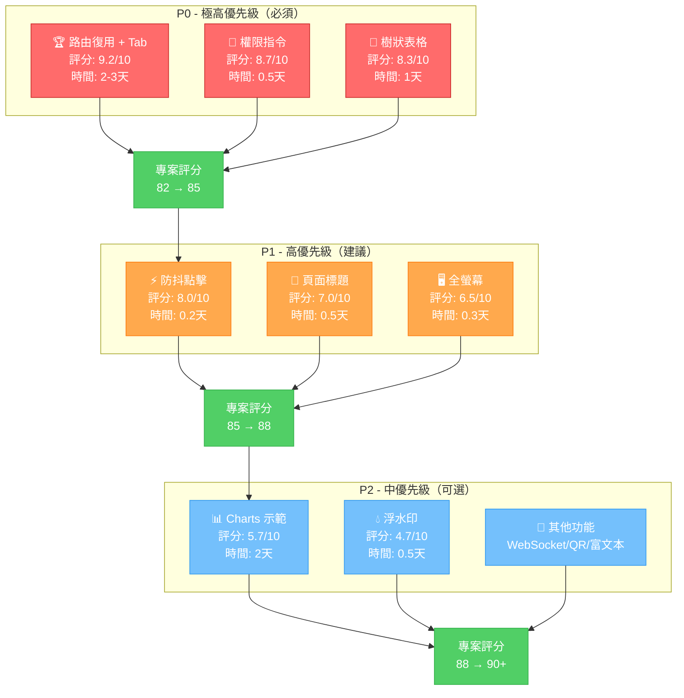
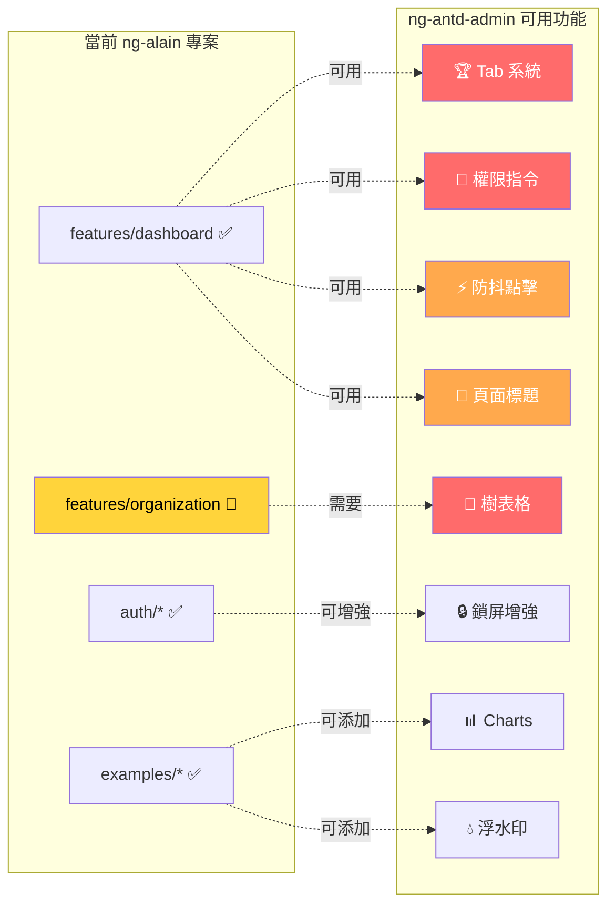
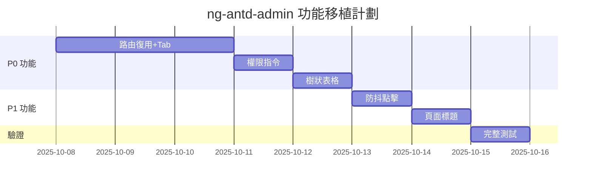

# ng-antd-admin 功能地圖（視覺化）

> **快速視覺化參考**: 一圖看懂所有可用功能

---

## 🗺️ 功能全景圖



---

## 🎯 功能模組地圖



---

## 📊 價值-難度矩陣

```
高價值 │ 🥇 路由復用+Tab  🥈 權限指令      │ 🥉 樹狀表格
      │   (9.2, 7/10)    (8.7, 3/10)     │  (8.3, 5/10)
      │                                   │
      │ ⚡ 防抖點擊      📄 頁面標題      │ 🖥️ 全螢幕
      │  (8.0, 2/10)     (7.0, 4/10)     │  (6.5, 3/10)
價值  │─────────────────────────────────│─────────────
      │ 📊 Charts       💧 浮水印        │
      │  (5.7, 5/10)    (4.7, 3/10)     │
低價值 │                                   │
      └──────────────────────────────────┘
         低難度                      高難度
         
圖例：(價值評分, 實施難度/10)
建議：優先執行左上角（高價值低難度）
```

---

## 🔥 立即可做（高 ROI）

### 1. 防抖點擊指令 ⚡
```
價值：⭐⭐⭐⭐ (8.0/10)
時間：10 分鐘
難度：⭐ (極簡單)
ROI：極高
```

**操作**:
```bash
# 1. 複製文件
Copy-Item docs/.../debounceClick.directive.ts src/app/shared/directives/

# 2. 匯出
# 在 shared/index.ts 添加：
export * from './directives/debounceClick.directive';

# 3. 使用
<button appDebounceClick (debounceClick)="save()">保存</button>
```

---

### 2. 權限指令（簡化版） 🔐
```
價值：⭐⭐⭐⭐⭐ (8.7/10)
時間：30 分鐘
難度：⭐ (簡單)
ROI：極高
```

**操作**:
```bash
# 1. 複製並修改
Copy-Item docs/.../auth.directive.ts src/app/shared/directives/

# 2. 修改為使用 @delon/acl
# 3. 使用
<button *appAuth="'user:delete'">刪除</button>
```

---

## 📅 實施時間線



**總時間**: 
- P0: 5 天（達到 88/100）
- P0+P1: 7 天（達到 90/100）

---

## 🎯 功能分類樹

```
ng-antd-admin 功能
│
├── 🔴 核心系統（P0）
│   ├── 路由復用策略 ⭐⭐⭐⭐⭐
│   ├── Tab 多頁簽系統 ⭐⭐⭐⭐⭐
│   ├── 權限指令 ⭐⭐⭐⭐⭐
│   └── 樹狀表格 ⭐⭐⭐⭐⭐
│
├── 🟡 實用增強（P1）
│   ├── 防抖點擊指令 ⭐⭐⭐⭐
│   ├── 頁面標題組件 ⭐⭐⭐
│   ├── 頂部進度條 ⭐⭐⭐
│   ├── 全螢幕切換 ⭐⭐⭐
│   └── 選擇性預加載 ⭐⭐⭐
│
└── 🟢 擴展功能（P2）
    ├── ECharts 完整示範 ⭐⭐⭐
    ├── 浮水印功能 ⭐⭐
    ├── WebSocket 通訊 ⭐⭐
    ├── QR Code 生成 ⭐⭐
    ├── 圖片預覽 ⭐⭐
    └── 富文本編輯器 ⭐⭐
```

---

## 📝 快速決策指南

### 問題 1：先做什麼？
**答案**: 路由復用 + Tab 系統

**理由**:
- ✅ 評分最高（9.2/10）
- ✅ 用戶體驗提升最大
- ✅ 是後台管理系統標配
- ✅ 解鎖其他功能

---

### 問題 2：最快能做什麼？
**答案**: 防抖點擊指令

**理由**:
- ✅ 10 分鐘完成
- ✅ 立即見效
- ✅ 零風險
- ✅ ROI 極高

---

### 問題 3：什麼最關鍵？
**答案**: 樹狀表格

**理由**:
- ✅ organization 模組無法完成的瓶頸
- ✅ 支援複雜樹狀數據
- ✅ 可復用性高

---

## 🔗 相關文檔

- [完整分析報告](ng-antd-admin-analysis.md) - 詳細分析
- [功能對比表](feature-comparison-table.md) - 快速對比
- [增強機會](../../active-context/context/enhancement-opportunities.md) - P0 功能詳解
- [快速摘要](../../active-context/context/ng-antd-admin-analysis-summary.md) - 2分鐘速覽

---

**建議行動**: 立即開始移植 P0 功能，預計 4天完成，專案評分提升 6分！🚀


