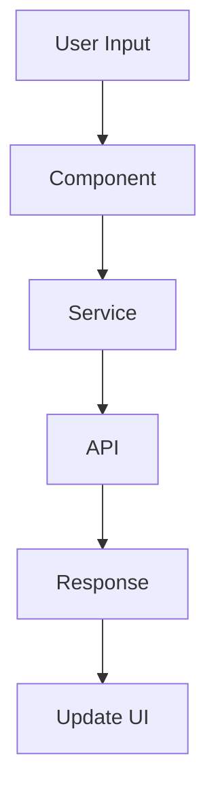

# Documentation Standards

## Documentation Structure

### Project Documentation
- **README.md**: Project overview and setup instructions
- **CONTRIBUTING.md**: Contribution guidelines
- **CHANGELOG.md**: Version history and changes
- **LICENSE**: Project license information
- **API.md**: API documentation

### Code Documentation
- **Inline Comments**: Explain complex logic
- **JSDoc**: Document public APIs and methods
- **Type Definitions**: Document interfaces and types
- **Examples**: Provide usage examples

## README.md Standards

### Required Sections
```markdown
# Project Title

Brief project description

## Features
- Key feature 1
- Key feature 2
- Key feature 3

## Prerequisites
- Node.js version requirements
- Package manager requirements
- System requirements

## Installation
```bash
# Installation commands
npm install
# or
yarn install
```

## Development
```bash
# Development server
npm start
# or
yarn start
```

## Building
```bash
# Production build
npm run build
# or
yarn build
```

## Testing
```bash
# Unit tests
npm test
# or
yarn test
```

## Contributing
See CONTRIBUTING.md for guidelines

## License
See LICENSE file
```

## API Documentation Standards

### JSDoc Format
```typescript
/**
 * Service for managing user data
 * @description Provides CRUD operations for user management
 * @example
 * ```typescript
 * constructor(private userService: UserService) {}
 * 
 * this.userService.getUsers().subscribe(users => {
 *   console.log(users);
 * });
 * ```
 */
@Injectable({
  providedIn: 'root'
})
export class UserService {
  /**
   * Retrieves all users
   * @returns Observable<User[]> Array of users
   * @throws {HttpErrorResponse} When API request fails
   */
  getUsers(): Observable<User[]> {
    // Implementation
  }

  /**
   * Creates a new user
   * @param user - User data to create
   * @returns Observable<User> Created user
   */
  createUser(user: CreateUserRequest): Observable<User> {
    // Implementation
  }
}
```

### Interface Documentation
```typescript
/**
 * User entity interface
 * @interface User
 */
export interface User {
  /** Unique user identifier */
  id: string;
  /** User's full name */
  name: string;
  /** User's email address */
  email: string;
  /** User's role in the system */
  role: UserRole;
  /** Account creation timestamp */
  createdAt: Date;
  /** Last update timestamp */
  updatedAt: Date;
}
```

## Component Documentation

### Component README Template
```markdown
# ComponentName

Brief component description

## Usage
```html
<app-component-name
  [inputProperty]="value"
  (outputEvent)="handler($event)">
</app-component-name>
```

## Properties
| Property | Type | Default | Description |
|----------|------|---------|-------------|
| inputProperty | string | '' | Description of property |

## Events
| Event | Type | Description |
|-------|------|-------------|
| outputEvent | EventEmitter<T> | Description of event |

## Examples
### Basic Usage
```html
<app-component-name></app-component-name>
```

### With Properties
```html
<app-component-name
  [inputProperty]="'custom value'"
  (outputEvent)="handleEvent($event)">
</app-component-name>
```
```

## Style Guide Documentation

### CSS/Less Documentation
```less
/**
 * Component styles for FeatureComponent
 * Uses BEM methodology for class naming
 */

// Variables
@component-padding: 16px;
@component-border-radius: 4px;

// Component styles
.feature-component {
  // Block styles
  padding: @component-padding;
  border-radius: @component-border-radius;

  // Element styles
  &__header {
    // Header element styles
  }

  &__content {
    // Content element styles
  }

  // Modifier styles
  &--large {
    // Large modifier styles
  }
}
```

## Testing Documentation

### Test Documentation Standards
```typescript
describe('FeatureComponent', () => {
  /**
   * Test suite for FeatureComponent
   * Tests component initialization, user interactions, and data handling
   */
  
  describe('Component Initialization', () => {
    it('should create component successfully', () => {
      // Test implementation
    });
  });

  describe('User Interactions', () => {
    it('should handle button click events', () => {
      // Test implementation
    });
  });

  describe('Data Handling', () => {
    it('should display data correctly', () => {
      // Test implementation
    });
  });
});
```

## Architecture Documentation

### System Architecture
```markdown
# System Architecture

## Overview
High-level system architecture description

## Components
### Core Components
- Component 1: Description
- Component 2: Description

### Feature Components
- Feature 1: Description
- Feature 2: Description

## Data Flow


## Dependencies
- Angular 20.3.0
- ng-alain 20.0.2
- ng-zorro-antd 20.3.1
```

## Deployment Documentation

### Build Process
```markdown
# Build Process

## Development Build
```bash
ng build
```

## Production Build
```bash
ng build --configuration production
```

## Build Optimization
- Tree shaking enabled
- Minification enabled
- Source maps disabled in production
- Bundle analysis available

## Deployment Steps
1. Run production build
2. Deploy dist folder to web server
3. Configure server for Angular routing
4. Set up monitoring and logging
```

## Maintenance Documentation

### Update Procedures
```markdown
# Update Procedures

## Dependency Updates
1. Check for updates: `npm outdated`
2. Update packages: `npm update`
3. Test application: `npm test`
4. Build application: `npm run build`

## Angular Updates
1. Check Angular update guide
2. Run Angular update command
3. Fix breaking changes
4. Update dependencies
5. Test thoroughly
```

## Documentation Maintenance

### Regular Updates
- **Monthly**: Review and update README files
- **Release**: Update CHANGELOG.md
- **Feature**: Update API documentation
- **Bug Fix**: Update known issues section

### Documentation Review
- **Accuracy**: Verify all information is current
- **Completeness**: Ensure all features are documented
- **Clarity**: Check for clear and understandable language
- **Examples**: Verify all examples work correctly
