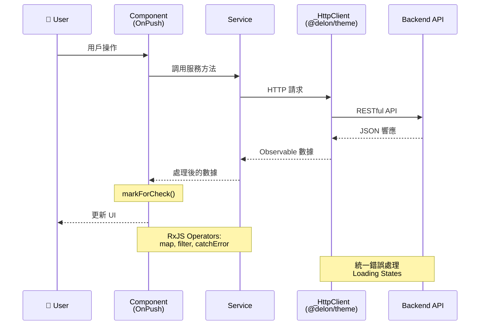

# 專案架構

## 🚀 快速導覽

### 核心理念
- **Standalone Components**: 100% standalone，不使用 NgModule
- **OnPush Strategy**: 所有組件使用 OnPush 變更檢測
- **Lazy Loading**: 所有功能模組懶加載
- **ng-alain + ng-zorro**: 企業級 Admin 框架 + Material Design UI

### 文檔導航
- 🎯 新手入門：先看 [設計哲學](designPhilosophy.md) 了解理念
- 📐 架構理解：本文檔提供完整架構視圖
- 📋 深入學習：查看 [架構決策記錄](architectureDecisions.md)
- 💻 實戰開發：參考 [技術模式](../patterns/technicalPatterns.md)

---

## 系統概述
ng-alain 是基於 Angular 20、ng-zorro-antd 的企業級後台管理框架。

## 架構分層

### 1. 展示層 (Presentation)
- **框架**: Angular 20.3.0 Standalone Components
- **UI 組件**: ng-zorro-antd 20.3.1
- **Admin 框架**: ng-alain 20.0.2
- **樣式**: Less + 動態主題

### 2. 應用層 (Application)
- **@delon/abc**: Admin 組件 (ST, SE)
- **@delon/acl**: 權限控制
- **@delon/auth**: 身份驗證
- **@delon/cache**: 緩存系統
- **@delon/form**: 表單處理
- **@delon/theme**: 主題系統

### 3. 基礎設施層 (Infrastructure)
- **建置**: Angular CLI + 8GB 記憶體
- **套件**: Yarn 4.9.2
- **品質**: ESLint + Stylelint + Prettier
- **測試**: Jasmine + Karma + Protractor

---

## 📐 架構全景圖

### 系統分層架構
```mermaid
graph TB
    subgraph "🎨 Presentation Layer 展示層"
        Angular[Angular 20.3.0<br/>Standalone Components]
        NZ[ng-zorro-antd 20.3.1<br/>Material Design UI]
        Layout[ng-alain Layouts<br/>basic/blank/passport]
    end
    
    subgraph "⚙️ Application Layer 應用層"
        ABC[@delon/abc<br/>ST, SE 組件]
        ACL[@delon/acl<br/>權限控制]
        Auth[@delon/auth<br/>身份驗證]
        Cache[@delon/cache<br/>緩存系統]
        Form[@delon/form<br/>表單處理]
        Theme[@delon/theme<br/>主題系統]
    end
    
    subgraph "🏗️ Infrastructure Layer 基礎設施層"
        CLI[Angular CLI<br/>8GB Memory Build]
        Tools[Code Quality<br/>ESLint + Stylelint + Prettier]
        Test[Testing<br/>Jasmine + Karma + Protractor]
        PM[Package Manager<br/>Yarn 4.9.2]
    end
    
    Angular --> ABC
    Angular --> ACL
    Angular --> Auth
    NZ --> Angular
    Layout --> Angular
    
    ABC --> CLI
    ACL --> CLI
    Auth --> CLI
    Cache --> CLI
    Form --> CLI
    Theme --> CLI
    
    CLI --> Tools
    CLI --> Test
    CLI --> PM
    
    style Angular fill:#dd0031,color:white,stroke:#c3002f
    style NZ fill:#1890ff,color:white,stroke:#096dd9
    style Layout fill:#52c41a,color:white,stroke:#389e0d
    style ABC fill:#722ed1,color:white,stroke:#531dab
    style ACL fill:#eb2f96,color:white,stroke:#c41d7f
    style Auth fill:#fa8c16,color:white,stroke:#d46b08
    style Cache fill:#13c2c2,color:white,stroke:#08979c
    style Form fill:#faad14,color:white,stroke:#d48806
    style Theme fill:#2f54eb,color:white,stroke:#1d39c4
```

### 資料流架構


---

## 目錄結構
```
src/app/
├── core/           # 核心服務、守衛、攔截器
├── layout/         # 佈局組件 (basic, blank, passport)
├── routes/         # 功能模組與路由
│   ├── dashboard/  # 儀表板
│   ├── delon/      # ng-alain 示範
│   ├── pro/        # Pro 組件
│   └── ...
└── shared/         # 共享模組與工具
```

## 關鍵架構模式

### 現代 Angular 模式
- **Standalone Components**: 100% 採用
- **Functional Guards**: CanActivateFn
- **inject() DI**: 函數式依賴注入
- **Native Control Flow**: @if, @for, @switch
- **OnPush Strategy**: 變更檢測優化

### 路由模式  
- **Lazy Loading**: 路由級代碼分割
- **Hash Routing**: 簡化部署
- **URL as State**: 路由狀態管理
- **Path Alias**: TypeScript 路徑映射

### 性能模式
- **Tree Shaking**: 自動移除未使用代碼
- **Bundle Optimization**: 源碼映射分析
- **Memory Management**: 8GB 建置配置
- **OnPush + trackBy**: 渲染優化

---

## 🔄 狀態管理架構

### Service-Based State Pattern
```mermaid
graph LR
    C[Components] --> S[StateService<br/>providedIn: root]
    S --> BS[BehaviorSubject<br/>State Store]
    BS --> O[Observable<br/>State Stream]
    O --> C
    
    R[Router State] -.URL as State.-> C
    Cache[@delon/cache] -.Persistent.-> S
    
    style S fill:#722ed1,color:white
    style BS fill:#fa8c16,color:white
    style Cache fill:#13c2c2,color:white
```

**核心原則**: Service 單例 + BehaviorSubject + Observable + URL as State

---

## 🛣️ 路由架構

### 路由結構與懶加載
```mermaid
graph TD
    Root[Root /] --> Auth{authGuard}
    Auth -->|未登入| Login[/passport/login]
    Auth -->|已登入| Layout[Layout]
    
    Layout --> Dashboard[/dashboard<br/>Lazy Loading]
    Layout --> Pro[/pro<br/>Lazy + roleGuard]
    Layout --> Delon[/delon<br/>Lazy Loading]
    
    style Root fill:#1890ff,color:white
    style Auth fill:#ff4d4f,color:white
    style Layout fill:#52c41a,color:white
```

**核心特性**: Hash Routing + Lazy Loading + Functional Guards + Path Alias

---

## 設計決策摘要

|| 決策 | 選擇 | 原因 |
||------|------|------|
|| 組件架構 | Standalone | 簡化結構，更好 tree-shaking |
|| 狀態管理 | Service + RxJS | Angular 內建，簡單易維護 |
|| 路由策略 | Hash + Lazy | 簡化部署，優化載入 |
|| 變更檢測 | OnPush | 40-60% 性能提升 |
|| 樣式處理 | Less | ng-zorro 無縫集成 |
|| 類型安全 | Strict Mode | 最大類型安全 |

---

## 📚 延伸閱讀

- [設計哲學](designPhilosophy.md) - 核心設計理念與原則
- [架構決策記錄](architectureDecisions.md) - 完整 ADR 記錄
- [開發模式](../patterns/developmentPatterns.md) - 實戰開發模式
- [技術模式](../patterns/technicalPatterns.md) - 技術實現細節
