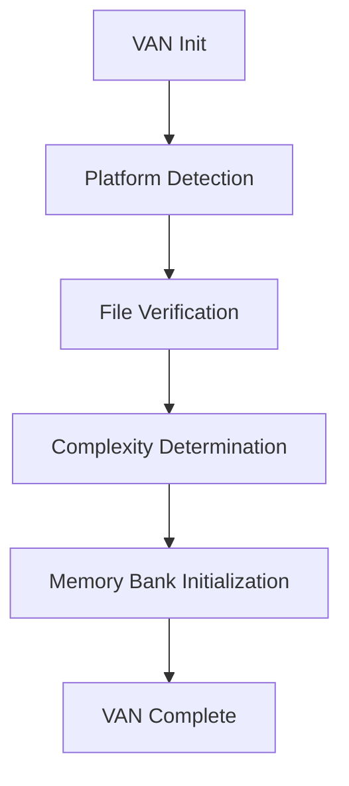

# Development Workflow

## VAN Mode Workflow

### 1. Initialization Phase

### 2. File Verification Workflow
- **Memory Bank Check**: Verify structure exists
- **Directory Validation**: Check required directories
- **File Validation**: Verify critical files
- **Content Validation**: Check file content integrity
- **Platform Adaptation**: Windows PowerShell optimization

### 3. Complexity Determination Workflow
- **Task Analysis**: Analyze requirements and scope
- **Level Classification**: Determine complexity (1-4)
- **Mode Selection**: Choose appropriate workflow
- **Transition Triggers**: Identify mode switches needed

## Development Lifecycle

### Phase 1: Planning (PLAN Mode)
- **Requirements Analysis**: Define project requirements
- **Architecture Design**: System architecture planning
- **Technology Selection**: Framework and tool choices
- **Timeline Estimation**: Project scheduling

### Phase 2: Creative (CREATIVE Mode)
- **Design Decisions**: UI/UX design choices
- **Component Design**: Component architecture
- **Pattern Selection**: Development patterns
- **Alternative Exploration**: Solution alternatives

### Phase 3: Implementation (BUILD Mode)
- **Code Generation**: Component implementation
- **Testing**: Unit and integration tests
- **Documentation**: Code documentation
- **Quality Assurance**: Code review and validation

### Phase 4: Validation (VAN QA Mode)
- **Dependency Verification**: Package validation
- **Configuration Check**: Setup validation
- **Environment Check**: Build environment
- **Build Test**: Minimal build validation

## Quality Assurance Workflow

### Pre-commit Checks
1. **Linting**: ESLint and Stylelint validation
2. **Formatting**: Prettier code formatting
3. **Testing**: Unit test execution
4. **Build Check**: Compilation validation

### Continuous Integration
1. **Automated Testing**: CI/CD pipeline
2. **Code Coverage**: Test coverage reporting
3. **Build Validation**: Production build test
4. **Deployment**: Automated deployment

## Memory Bank Integration

### Context Preservation
- **Active Context**: Current focus tracking
- **System Patterns**: Architecture documentation
- **Creative Decisions**: Design choice records
- **Implementation Log**: Code change tracking

### Archive Management
- **Completed Tasks**: Finished work archive
- **Historical Data**: Project history
- **Backup Strategy**: Data protection
- **Version Control**: Change tracking
