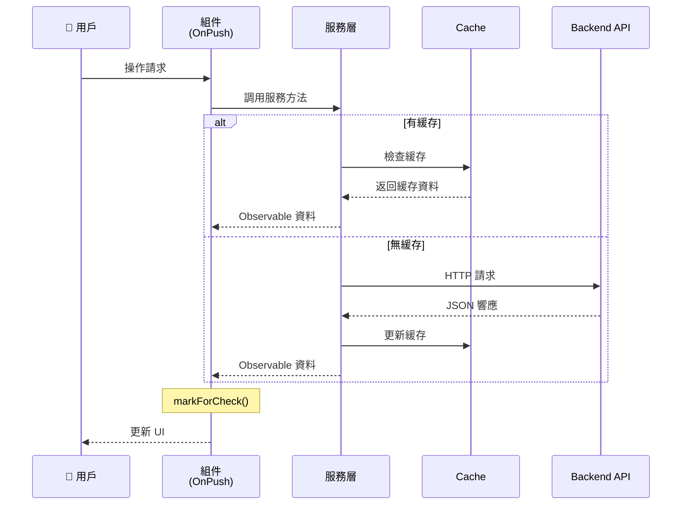

# 組織管理模組 - 詳細設計文檔

> 📐 完整的技術設計與實施指南

## 🎯 設計目標

### 核心目標
1. 提供直觀的組織架構視覺化管理
2. 實現完整的部門與員工生命週期管理
3. 整合 RBAC 權限控制系統
4. 確保高性能與良好的用戶體驗

### 非功能需求
- **性能**: 組織樹渲染 <200ms，列表載入 <500ms
- **可用性**: 支援鍵盤操作，符合 WCAG 2.1 AA 標準
- **安全性**: 完整的權限控制，防止越權操作
- **可維護性**: 模組化設計，單元測試覆蓋率 >80%

---

## 📊 架構設計

### 整體架構圖
```mermaid
graph TB
    subgraph "展示層"
        OrgTree[組織架構樹組件]
        DeptList[部門列表組件]
        EmpList[員工列表組件]
        RoleMgmt[角色管理組件]
    end
    
    subgraph "服務層"
        OrgService[OrganizationService]
        DeptService[DepartmentService]
        EmpService[EmployeeService]
        RoleService[RoleService]
    end
    
    subgraph "資料層"
        HttpClient[_HttpClient]
        Cache[@delon/cache]
        ACL[@delon/acl]
    end
    
    OrgTree --> OrgService
    DeptList --> DeptService
    EmpList --> EmpService
    RoleMgmt --> RoleService
    
    OrgService --> HttpClient
    DeptService --> HttpClient
    EmpService --> HttpClient
    RoleService --> ACL
    
    OrgService --> Cache
    DeptService --> Cache
    
    style OrgTree fill:#52c41a,color:white
    style DeptList fill:#1890ff,color:white
    style EmpList fill:#722ed1,color:white
    style RoleMgmt fill:#fa8c16,color:white
```

### 資料流設計


---

## 📋 資料模型設計

### 1. Organization（組織實體）
```typescript
/**
 * 組織實體介面
 * @description 定義組織的基本結構和屬性
 */
export interface Organization {
  /** 組織唯一識別碼 */
  id: string;
  
  /** 組織名稱 */
  name: string;
  
  /** 父組織 ID（根組織為 null） */
  parentId: string | null;
  
  /** 組織類型 */
  type: OrganizationType;
  
  /** 組織層級（從 1 開始） */
  level: number;
  
  /** 子組織列表 */
  children?: Organization[];
  
  /** 組織編碼（用於排序和編號） */
  code?: string;
  
  /** 組織描述 */
  description?: string;
  
  /** 組織狀態 */
  status: OrganizationStatus;
  
  /** 排序順序 */
  order: number;
  
  /** 創建時間 */
  createdAt: Date;
  
  /** 更新時間 */
  updatedAt: Date;
  
  /** 創建者 ID */
  createdBy?: string;
  
  /** 最後更新者 ID */
  updatedBy?: string;
}

/**
 * 組織類型枚舉
 */
export enum OrganizationType {
  /** 公司 */
  Company = 'company',
  
  /** 事業部 */
  Division = 'division',
  
  /** 部門 */
  Department = 'department',
  
  /** 團隊 */
  Team = 'team',
  
  /** 小組 */
  Group = 'group'
}

/**
 * 組織狀態枚舉
 */
export enum OrganizationStatus {
  /** 啟用 */
  Active = 'active',
  
  /** 停用 */
  Inactive = 'inactive',
  
  /** 已歸檔 */
  Archived = 'archived'
}
```

### 2. Department（部門實體）
```typescript
/**
 * 部門實體介面
 */
export interface Department {
  /** 部門 ID */
  id: string;
  
  /** 部門名稱 */
  name: string;
  
  /** 所屬組織 ID */
  organizationId: string;
  
  /** 部門負責人 ID */
  managerId: string;
  
  /** 部門負責人資訊 */
  manager?: Employee;
  
  /** 部門成員數量 */
  memberCount: number;
  
  /** 部門描述 */
  description?: string;
  
  /** 部門狀態 */
  status: DepartmentStatus;
  
  /** 部門類型 */
  type?: string;
  
  /** 聯絡電話 */
  phone?: string;
  
  /** 電子郵件 */
  email?: string;
  
  /** 辦公地點 */
  location?: string;
  
  /** 創建時間 */
  createdAt: Date;
  
  /** 更新時間 */
  updatedAt: Date;
}

/**
 * 部門狀態枚舉
 */
export enum DepartmentStatus {
  /** 正常運作 */
  Active = 'active',
  
  /** 暫時停用 */
  Inactive = 'inactive',
  
  /** 重組中 */
  Restructuring = 'restructuring',
  
  /** 已解散 */
  Dissolved = 'dissolved'
}
```

### 3. Employee（員工實體）
```typescript
/**
 * 員工實體介面
 */
export interface Employee {
  /** 員工 ID */
  id: string;
  
  /** 員工姓名 */
  name: string;
  
  /** 電子郵件 */
  email: string;
  
  /** 所屬部門 ID */
  departmentId: string;
  
  /** 部門資訊 */
  department?: Department;
  
  /** 角色 ID 列表 */
  roleIds: string[];
  
  /** 角色列表 */
  roles?: Role[];
  
  /** 職位 */
  position: string;
  
  /** 員工編號 */
  employeeNumber?: string;
  
  /** 員工狀態 */
  status: EmployeeStatus;
  
  /** 頭像 URL */
  avatar?: string;
  
  /** 聯絡電話 */
  phone?: string;
  
  /** 行動電話 */
  mobile?: string;
  
  /** 入職日期 */
  joinDate: Date;
  
  /** 離職日期 */
  leaveDate?: Date;
  
  /** 直屬主管 ID */
  supervisorId?: string;
  
  /** 工作地點 */
  workLocation?: string;
  
  /** 緊急聯絡人 */
  emergencyContact?: {
    name: string;
    phone: string;
    relationship: string;
  };
  
  /** 創建時間 */
  createdAt: Date;
  
  /** 更新時間 */
  updatedAt: Date;
}

/**
 * 員工狀態枚舉
 */
export enum EmployeeStatus {
  /** 在職 */
  Active = 'active',
  
  /** 離職 */
  Inactive = 'inactive',
  
  /** 休假中 */
  OnLeave = 'on_leave',
  
  /** 試用期 */
  Probation = 'probation',
  
  /** 停職 */
  Suspended = 'suspended'
}
```

### 4. Role（角色實體）
```typescript
/**
 * 角色實體介面
 */
export interface Role {
  /** 角色 ID */
  id: string;
  
  /** 角色名稱 */
  name: string;
  
  /** 角色編碼（用於程式判斷） */
  code: string;
  
  /** 權限列表 */
  permissions: string[];
  
  /** 角色層級 */
  level: RoleLevel;
  
  /** 角色描述 */
  description?: string;
  
  /** 角色類型 */
  type: RoleType;
  
  /** 是否為系統角色（不可刪除） */
  isSystem: boolean;
  
  /** 創建時間 */
  createdAt: Date;
  
  /** 更新時間 */
  updatedAt: Date;
}

/**
 * 角色層級枚舉
 */
export enum RoleLevel {
  /** 擁有者 - 最高權限 */
  Owner = 1,
  
  /** 管理員 - 管理權限 */
  Admin = 2,
  
  /** 成員 - 基本權限 */
  Member = 3,
  
  /** 訪客 - 只讀權限 */
  Viewer = 4
}

/**
 * 角色類型枚舉
 */
export enum RoleType {
  /** 組織角色 */
  Organization = 'organization',
  
  /** 部門角色 */
  Department = 'department',
  
  /** 專案角色 */
  Project = 'project',
  
  /** 自訂角色 */
  Custom = 'custom'
}
```

### 5. 通用介面
```typescript
/**
 * 查詢參數介面
 */
export interface QueryParams {
  /** 頁碼（從 1 開始） */
  page?: number;
  
  /** 每頁數量 */
  pageSize?: number;
  
  /** 搜尋關鍵字 */
  search?: string;
  
  /** 排序欄位 */
  sortBy?: string;
  
  /** 排序方向 */
  sortOrder?: 'asc' | 'desc';
  
  /** 過濾條件 */
  filters?: Record<string, any>;
}

/**
 * 分頁結果介面
 */
export interface PagedResult<T> {
  /** 資料列表 */
  data: T[];
  
  /** 總數量 */
  total: number;
  
  /** 當前頁碼 */
  page: number;
  
  /** 每頁數量 */
  pageSize: number;
  
  /** 總頁數 */
  totalPages: number;
  
  /** 是否有下一頁 */
  hasNext: boolean;
  
  /** 是否有上一頁 */
  hasPrev: boolean;
}

/**
 * API 響應介面
 */
export interface ApiResponse<T> {
  /** 狀態碼 */
  code: number;
  
  /** 訊息 */
  message: string;
  
  /** 資料 */
  data: T;
  
  /** 時間戳 */
  timestamp: number;
}
```

---

## 🔧 服務層設計

### 1. OrganizationService
```typescript
import { Injectable, inject } from '@angular/core';
import { Observable } from 'rxjs';
import { map, tap } from 'rxjs/operators';
import { _HttpClient } from '@delon/theme';
import { CacheService } from '@delon/cache';
import { Organization, OrganizationType } from '../models/organization.model';

/**
 * 組織服務
 * @description 提供組織架構的 CRUD 操作和樹狀結構管理
 */
@Injectable({ providedIn: 'root' })
export class OrganizationService {
  private readonly http = inject(_HttpClient);
  private readonly cache = inject(CacheService);
  private readonly API_BASE = '/api/organizations';
  
  // 緩存鍵
  private readonly CACHE_KEY_TREE = 'org:tree';
  private readonly CACHE_KEY_ORG = (id: string) => `org:${id}`;

  /**
   * 獲取組織架構樹
   * @param useCache 是否使用緩存
   * @returns Observable<Organization[]>
   */
  getOrganizationTree(useCache = true): Observable<Organization[]> {
    if (useCache) {
      const cached = this.cache.get(this.CACHE_KEY_TREE);
      if (cached) {
        return of(cached);
      }
    }
    
    return this.http.get<Organization[]>(`${this.API_BASE}/tree`).pipe(
      tap(data => this.cache.set(this.CACHE_KEY_TREE, data, { expire: 300 }))
    );
  }

  /**
   * 獲取單個組織資訊
   * @param id 組織 ID
   * @returns Observable<Organization>
   */
  getOrganization(id: string): Observable<Organization> {
    const cacheKey = this.CACHE_KEY_ORG(id);
    const cached = this.cache.get(cacheKey);
    
    if (cached) {
      return of(cached);
    }
    
    return this.http.get<Organization>(`${this.API_BASE}/${id}`).pipe(
      tap(data => this.cache.set(cacheKey, data, { expire: 300 }))
    );
  }

  /**
   * 創建組織
   * @param data 組織資料
   * @returns Observable<Organization>
   */
  createOrganization(data: Partial<Organization>): Observable<Organization> {
    return this.http.post<Organization>(this.API_BASE, data).pipe(
      tap(() => this.clearCache())
    );
  }

  /**
   * 更新組織
   * @param id 組織 ID
   * @param data 更新資料
   * @returns Observable<Organization>
   */
  updateOrganization(id: string, data: Partial<Organization>): Observable<Organization> {
    return this.http.put<Organization>(`${this.API_BASE}/${id}`, data).pipe(
      tap(() => this.clearCache())
    );
  }

  /**
   * 刪除組織
   * @param id 組織 ID
   * @returns Observable<void>
   */
  deleteOrganization(id: string): Observable<void> {
    return this.http.delete<void>(`${this.API_BASE}/${id}`).pipe(
      tap(() => this.clearCache())
    );
  }

  /**
   * 移動組織到新的父組織下
   * @param id 組織 ID
   * @param newParentId 新父組織 ID
   * @returns Observable<Organization>
   */
  moveOrganization(id: string, newParentId: string): Observable<Organization> {
    return this.http.put<Organization>(`${this.API_BASE}/${id}/move`, { newParentId }).pipe(
      tap(() => this.clearCache())
    );
  }

  /**
   * 獲取組織的所有子節點
   * @param id 組織 ID
   * @returns Observable<Organization[]>
   */
  getChildren(id: string): Observable<Organization[]> {
    return this.http.get<Organization[]>(`${this.API_BASE}/${id}/children`);
  }

  /**
   * 獲取組織的完整路徑
   * @param id 組織 ID
   * @returns Observable<Organization[]>
   */
  getPath(id: string): Observable<Organization[]> {
    return this.http.get<Organization[]>(`${this.API_BASE}/${id}/path`);
  }

  /**
   * 清除緩存
   */
  private clearCache(): void {
    this.cache.remove(this.CACHE_KEY_TREE);
    // 清除所有組織緩存
    this.cache.clear(/^org:/);
  }
}
```

### 2. DepartmentService
```typescript
import { Injectable, inject } from '@angular/core';
import { Observable } from 'rxjs';
import { _HttpClient } from '@delon/theme';
import { Department } from '../models/department.model';
import { QueryParams, PagedResult } from '../models/common.model';

/**
 * 部門服務
 * @description 提供部門管理的 CRUD 操作
 */
@Injectable({ providedIn: 'root' })
export class DepartmentService {
  private readonly http = inject(_HttpClient);
  private readonly API_BASE = '/api/departments';

  /**
   * 獲取部門列表（分頁）
   * @param params 查詢參數
   * @returns Observable<PagedResult<Department>>
   */
  getDepartments(params?: QueryParams): Observable<PagedResult<Department>> {
    return this.http.get<PagedResult<Department>>(this.API_BASE, params);
  }

  /**
   * 獲取單個部門資訊
   * @param id 部門 ID
   * @returns Observable<Department>
   */
  getDepartment(id: string): Observable<Department> {
    return this.http.get<Department>(`${this.API_BASE}/${id}`);
  }

  /**
   * 創建部門
   * @param data 部門資料
   * @returns Observable<Department>
   */
  createDepartment(data: Partial<Department>): Observable<Department> {
    return this.http.post<Department>(this.API_BASE, data);
  }

  /**
   * 更新部門
   * @param id 部門 ID
   * @param data 更新資料
   * @returns Observable<Department>
   */
  updateDepartment(id: string, data: Partial<Department>): Observable<Department> {
    return this.http.put<Department>(`${this.API_BASE}/${id}`, data);
  }

  /**
   * 刪除部門
   * @param id 部門 ID
   * @returns Observable<void>
   */
  deleteDepartment(id: string): Observable<void> {
    return this.http.delete<void>(`${this.API_BASE}/${id}`);
  }

  /**
   * 批次刪除部門
   * @param ids 部門 ID 列表
   * @returns Observable<void>
   */
  batchDeleteDepartments(ids: string[]): Observable<void> {
    return this.http.delete<void>(`${this.API_BASE}/batch`, { ids });
  }

  /**
   * 獲取組織下的所有部門
   * @param organizationId 組織 ID
   * @returns Observable<Department[]>
   */
  getDepartmentsByOrganization(organizationId: string): Observable<Department[]> {
    return this.http.get<Department[]>(`${this.API_BASE}/organization/${organizationId}`);
  }

  /**
   * 獲取部門成員列表
   * @param departmentId 部門 ID
   * @returns Observable<Employee[]>
   */
  getDepartmentMembers(departmentId: string): Observable<Employee[]> {
    return this.http.get<Employee[]>(`${this.API_BASE}/${departmentId}/members`);
  }

  /**
   * 匯出部門資料
   * @param params 查詢參數
   * @returns Observable<Blob>
   */
  exportDepartments(params?: QueryParams): Observable<Blob> {
    return this.http.get(`${this.API_BASE}/export`, params, {
      responseType: 'blob'
    });
  }
}
```

---

## 🎨 組件設計

### 1. OrganizationTreeComponent（組織架構樹）

#### 組件結構
```typescript
import { Component, inject, signal, computed, ChangeDetectionStrategy } from '@angular/core';
import { CommonModule } from '@angular/common';
import { FormsModule } from '@angular/forms';
import { NzTreeModule, NzTreeNodeOptions, NzFormatEmitEvent } from 'ng-zorro-antd/tree';
import { NzButtonModule } from 'ng-zorro-antd/button';
import { NzInputModule } from 'ng-zorro-antd/input';
import { NzIconModule } from 'ng-zorro-antd/icon';
import { NzModalModule, NzModalService } from 'ng-zorro-antd/modal';
import { NzMessageService } from 'ng-zorro-antd/message';
import { OrganizationService } from '../../services/organization.service';
import { Organization } from '../../models/organization.model';

/**
 * 組織架構樹組件
 * @description 展示和管理組織架構的樹狀結構
 */
@Component({
  selector: 'app-organization-tree',
  standalone: true,
  imports: [
    CommonModule,
    FormsModule,
    NzTreeModule,
    NzButtonModule,
    NzInputModule,
    NzIconModule,
    NzModalModule
  ],
  templateUrl: './organization-tree.component.html',
  styleUrls: ['./organization-tree.component.less'],
  changeDetection: ChangeDetectionStrategy.OnPush
})
export class OrganizationTreeComponent {
  private readonly orgService = inject(OrganizationService);
  private readonly modal = inject(NzModalService);
  private readonly message = inject(NzMessageService);

  // Signals
  nodes = signal<NzTreeNodeOptions[]>([]);
  loading = signal(false);
  searchValue = signal('');
  selectedNode = signal<NzTreeNodeOptions | null>(null);
  expandedKeys = signal<string[]>([]);

  // Computed
  filteredNodes = computed(() => {
    const search = this.searchValue().toLowerCase();
    if (!search) return this.nodes();
    return this.filterNodes(this.nodes(), search);
  });

  ngOnInit(): void {
    this.loadOrganizationTree();
  }

  /**
   * 載入組織架構樹
   */
  loadOrganizationTree(): void {
    this.loading.set(true);
    this.orgService.getOrganizationTree().subscribe({
      next: (data) => {
        this.nodes.set(this.transformToTreeNodes(data));
        this.loading.set(false);
      },
      error: (err) => {
        this.message.error('載入組織架構失敗');
        this.loading.set(false);
      }
    });
  }

  /**
   * 轉換資料為樹節點格式
   */
  private transformToTreeNodes(orgs: Organization[]): NzTreeNodeOptions[] {
    return orgs.map(org => ({
      title: org.name,
      key: org.id,
      expanded: true,
      isLeaf: !org.children || org.children.length === 0,
      children: org.children ? this.transformToTreeNodes(org.children) : [],
      origin: org
    }));
  }

  /**
   * 過濾節點
   */
  private filterNodes(nodes: NzTreeNodeOptions[], search: string): NzTreeNodeOptions[] {
    return nodes.reduce((acc, node) => {
      const matchesSearch = node.title.toLowerCase().includes(search);
      const filteredChildren = node.children 
        ? this.filterNodes(node.children, search) 
        : [];
      
      if (matchesSearch || filteredChildren.length > 0) {
        acc.push({
          ...node,
          expanded: true,
          children: filteredChildren
        });
      }
      
      return acc;
    }, [] as NzTreeNodeOptions[]);
  }

  /**
   * 節點點擊事件
   */
  onNodeClick(event: NzFormatEmitEvent): void {
    this.selectedNode.set(event.node!);
  }

  /**
   * 節點拖拽事件
   */
  onNodeDrop(event: NzFormatEmitEvent): void {
    const dragNode = event.dragNode!;
    const targetNode = event.node!;
    
    if (dragNode && targetNode) {
      this.orgService.moveOrganization(
        dragNode.key as string,
        targetNode.key as string
      ).subscribe({
        next: () => {
          this.message.success('組織移動成功');
          this.loadOrganizationTree();
        },
        error: () => {
          this.message.error('組織移動失敗');
        }
      });
    }
  }

  /**
   * 新增組織
   */
  onAddNode(parentNode?: NzTreeNodeOptions): void {
    // 打開新增組織對話框
    // 實現細節在表單組件中
  }

  /**
   * 編輯組織
   */
  onEditNode(node: NzTreeNodeOptions): void {
    // 打開編輯組織對話框
  }

  /**
   * 刪除組織
   */
  onDeleteNode(node: NzTreeNodeOptions): void {
    this.modal.confirm({
      nzTitle: '確定要刪除此組織嗎？',
      nzContent: '刪除後將無法恢復，且會一併刪除所有子組織',
      nzOkText: '確定刪除',
      nzOkDanger: true,
      nzOnOk: () => {
        return this.orgService.deleteOrganization(node.key as string).toPromise()
          .then(() => {
            this.message.success('組織刪除成功');
            this.loadOrganizationTree();
          })
          .catch(() => {
            this.message.error('組織刪除失敗');
          });
      }
    });
  }

  /**
   * 展開所有節點
   */
  expandAll(): void {
    const getAllKeys = (nodes: NzTreeNodeOptions[]): string[] => {
      return nodes.reduce((keys, node) => {
        keys.push(node.key as string);
        if (node.children) {
          keys.push(...getAllKeys(node.children));
        }
        return keys;
      }, [] as string[]);
    };
    
    this.expandedKeys.set(getAllKeys(this.nodes()));
  }

  /**
   * 收起所有節點
   */
  collapseAll(): void {
    this.expandedKeys.set([]);
  }
}
```

#### 模板設計
```html
<!-- organization-tree.component.html -->
<div class="organization-tree-container">
  <!-- 工具列 -->
  <div class="toolbar">
    <nz-input-group [nzPrefix]="prefixIconSearch">
      <input
        nz-input
        placeholder="搜尋組織"
        [(ngModel)]="searchValue"
      />
    </nz-input-group>
    <ng-template #prefixIconSearch>
      <span nz-icon nzType="search"></span>
    </ng-template>
    
    <div class="toolbar-actions">
      <button nz-button (click)="expandAll()">
        <span nz-icon nzType="plus-square"></span>
        展開全部
      </button>
      <button nz-button (click)="collapseAll()">
        <span nz-icon nzType="minus-square"></span>
        收起全部
      </button>
      <button 
        nz-button 
        nzType="primary"
        *aclIf="'organization.create'"
        (click)="onAddNode()">
        <span nz-icon nzType="plus"></span>
        新增組織
      </button>
    </div>
  </div>

  <!-- 組織樹 -->
  @if (loading()) {
    <nz-spin nzSimple [nzSize]="'large'"></nz-spin>
  } @else if (filteredNodes().length > 0) {
    <nz-tree
      [nzData]="filteredNodes()"
      [nzDraggable]="true"
      [nzExpandedKeys]="expandedKeys()"
      (nzClick)="onNodeClick($event)"
      (nzOnDrop)="onNodeDrop($event)">
      <ng-template #nzTreeTemplate let-node>
        <div class="tree-node">
          <span class="node-title">{{ node.title }}</span>
          <div class="node-actions" *aclIf="'organization.edit'">
            <button 
              nz-button 
              nzType="link" 
              nzSize="small"
              (click)="onAddNode(node)">
              <span nz-icon nzType="plus"></span>
            </button>
            <button 
              nz-button 
              nzType="link" 
              nzSize="small"
              (click)="onEditNode(node)">
              <span nz-icon nzType="edit"></span>
            </button>
            <button 
              nz-button 
              nzType="link" 
              nzSize="small" 
              nzDanger
              *aclIf="'organization.delete'"
              (click)="onDeleteNode(node)">
              <span nz-icon nzType="delete"></span>
            </button>
          </div>
        </div>
      </ng-template>
    </nz-tree>
  } @else {
    <nz-empty nzNotFoundContent="無組織資料"></nz-empty>
  }
</div>
```

---

## 🛡️ 守衛設計

### organization.guard.ts
```typescript
import { inject } from '@angular/core';
import { CanActivateFn, Router, ActivatedRouteSnapshot, RouterStateSnapshot } from '@angular/router';
import { ACLService } from '@delon/acl';
import { NzNotificationService } from 'ng-zorro-antd/notification';
import { of } from 'rxjs';
import { map, catchError } from 'rxjs/operators';

/**
 * 組織管理權限守衛
 * @description 檢查用戶是否有訪問組織管理功能的權限
 */
export const organizationGuard: CanActivateFn = (
  route: ActivatedRouteSnapshot,
  state: RouterStateSnapshot
) => {
  const aclService = inject(ACLService);
  const router = inject(Router);
  const notification = inject(NzNotificationService);
  
  // 從路由資料中獲取所需權限
  const requiredPermissions = route.data?.['permissions'] as string[];
  
  // 如果沒有指定權限要求，則允許訪問
  if (!requiredPermissions || requiredPermissions.length === 0) {
    return true;
  }
  
  // 檢查權限
  return aclService.canAbility(requiredPermissions).pipe(
    map(hasPermission => {
      if (!hasPermission) {
        notification.error(
          '權限不足',
          '您沒有訪問此頁面的權限，請聯繫管理員'
        );
        router.navigate(['/403']);
        return false;
      }
      return true;
    }),
    catchError(err => {
      console.error('權限驗證失敗', err);
      notification.error('錯誤', '權限驗證失敗，請稍後再試');
      router.navigate(['/error']);
      return of(false);
    })
  );
};

/**
 * 組織編輯權限守衛
 * @description 檢查用戶是否有編輯組織的權限
 */
export const organizationEditGuard: CanActivateFn = (route, state) => {
  const aclService = inject(ACLService);
  const notification = inject(NzNotificationService);
  
  return aclService.can('organization.edit').pipe(
    map(canEdit => {
      if (!canEdit) {
        notification.warning('權限不足', '您沒有編輯組織的權限');
        return false;
      }
      return true;
    })
  );
};
```

---

## 🛣️ 路由配置

### routes.ts
```typescript
import { Routes } from '@angular/router';
import { authGuard } from '@core/guards/auth.guard';
import { organizationGuard } from './guards/organization.guard';

/**
 * 組織管理模組路由配置
 */
export const routes: Routes = [
  {
    path: '',
    canActivate: [authGuard],
    children: [
      // 重定向到組織架構頁面
      {
        path: '',
        redirectTo: 'structure',
        pathMatch: 'full'
      },
      
      // 組織架構樹
      {
        path: 'structure',
        loadComponent: () => 
          import('./components/organization-tree/organization-tree.component')
            .then(m => m.OrganizationTreeComponent),
        data: {
          title: '組織架構',
          permissions: ['organization.view']
        },
        canActivate: [organizationGuard]
      },
      
      // 部門管理
      {
        path: 'departments',
        children: [
          {
            path: '',
            loadComponent: () =>
              import('./components/department-list/department-list.component')
                .then(m => m.DepartmentListComponent),
            data: {
              title: '部門列表',
              permissions: ['department.view']
            },
            canActivate: [organizationGuard]
          },
          {
            path: ':id',
            loadComponent: () =>
              import('./components/department-detail/department-detail.component')
                .then(m => m.DepartmentDetailComponent),
            data: {
              title: '部門詳情',
              permissions: ['department.view']
            },
            canActivate: [organizationGuard]
          }
        ]
      },
      
      // 員工管理
      {
        path: 'employees',
        children: [
          {
            path: '',
            loadComponent: () =>
              import('./components/employee-list/employee-list.component')
                .then(m => m.EmployeeListComponent),
            data: {
              title: '員工列表',
              permissions: ['employee.view']
            },
            canActivate: [organizationGuard]
          },
          {
            path: ':id',
            loadComponent: () =>
              import('./components/employee-detail/employee-detail.component')
                .then(m => m.EmployeeDetailComponent),
            data: {
              title: '員工詳情',
              permissions: ['employee.view']
            },
            canActivate: [organizationGuard]
          }
        ]
      },
      
      // 角色管理
      {
        path: 'roles',
        loadComponent: () =>
          import('./components/role-management/role-management.component')
            .then(m => m.RoleManagementComponent),
        data: {
          title: '角色管理',
          permissions: ['role.manage']
        },
        canActivate: [organizationGuard]
      }
    ]
  }
];
```

---

## 📈 實施檢查清單

### Phase 1: 基礎架構 ✅
- [x] 創建目錄結構
- [ ] 定義所有資料模型 interface
- [ ] 實現服務層（CRUD 操作）
- [ ] 配置路由與守衛
- [ ] 設置 Mock 資料

### Phase 2: 核心功能
- [ ] 實現 OrganizationTreeComponent
- [ ] 實現 DepartmentListComponent
- [ ] 實現 DepartmentFormComponent
- [ ] 實現 EmployeeListComponent
- [ ] 實現 EmployeeFormComponent
- [ ] 實現基本 CRUD 操作

### Phase 3: 權限整合
- [ ] 實現 organizationGuard
- [ ] 整合 @delon/acl
- [ ] 實現 RoleManagementComponent
- [ ] 在組件中應用權限檢查
- [ ] 測試權限控制邏輯

### Phase 4: 優化與測試
- [ ] 性能優化（OnPush、trackBy、Virtual Scrolling）
- [ ] 撰寫單元測試（目標 80% 覆蓋率）
- [ ] 撰寫 E2E 測試
- [ ] 代碼審查與重構
- [ ] 文檔完善

---

## 📝 後續步驟

1. **審查設計文檔**：團隊成員審查並提供反饋
2. **建立 Mock 資料**：在 `_mock` 目錄創建組織管理 API
3. **實施 Phase 1**：建立基礎架構
4. **迭代開發**：按 Phase 逐步實現功能
5. **持續測試**：每個 Phase 完成後進行測試
6. **文檔更新**：及時更新技術文檔

---

**文檔版本**: v1.0.0  
**最後更新**: 2025-10-07  
**維護者**: 開發團隊

